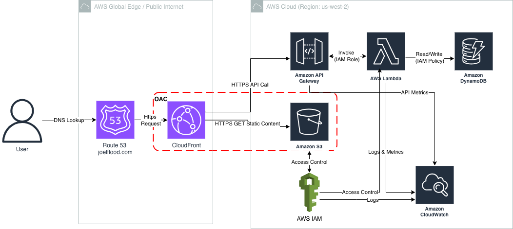

# AWS Cloud Resume Challenge – Art & Professional Portfolio

This project is my implementation of the **AWS Cloud Resume Challenge**, adapted into a personal website that combines an art portfolio with a professional resume page.  
The goal is to demonstrate end-to-end use of AWS cloud services while creating something personal, creative, and technically sound.

---

## Overview

I’m building a responsive, static website hosted entirely in the AWS ecosystem.  
It highlights my artwork across multiple decades and includes a dedicated page for my professional background in **security, governance, risk, and compliance (GRC)**.

The site consists of:
- **Art portfolio pages** organized by decade (1990s–2020s) and medium.
- A **Professional** page that includes my resume and links to LinkedIn and GitHub.
- A **serverless visitor counter** using Lambda, DynamoDB, and API Gateway.
- **CI/CD automation** for continuous deployment.
- Documentation that ties technical implementation to **security and GRC principles**.
- Implementation of security controls including geo-blocking and enhanced security-header settings in CloudFront.

---

## Architecture Summary

The project follows a standard CRC architecture using AWS managed services:



| Layer | AWS Service | Purpose |
|--------|--------------|----------|
| DNS | **Route 53** | Route traffic from endpoint to CloudFront |
| Frontend | **S3** | Host static HTML, CSS, and image assets |
| Delivery | **CloudFront** | Provide HTTPS, global distribution, and caching |
| Backend | **API Gateway + Lambda** | Handle visitor counter logic |
| Database | **DynamoDB** | Store visitor count data |
| Access & Logging | **IAM, CloudWatch, CloudTrail** | Security, monitoring, and auditing |
| CI/CD | **GitHub Actions** | Automate deployment to S3 and CloudFront invalidation |

All services are configured with encryption, logging, and least-privilege IAM policies.  
The entire deployment aims to stay within AWS Free Tier and inexpensive services, with some nominal charges for services like Route 53 DNS routing.

---

## Repository Structure

```text
cloud-resume-challenge/
├── README.md                 # Project overview
├── crc-plan.md               # Project plan and progress notes
├── diagrams/
│   └── architecture.png      # Architecture diagram
├── infrastructure/           # IaC templates for backend services
│   └── visitor-counter.yml
├── resume-site/              # Static website
│   ├── robots.txt			  # Block "/images/" folder from search engines	
│   ├── sitemap.xml
│   ├── about.html
│   ├── 1990s.html
│   ├── 2000s.html
│   ├── 2010s.html
│   ├── 2020s.html
│   ├── digital-media.html
│   ├── professional.html	  # Resume
│   ├── favicon-16.png
│   ├── favicon-32.png
│   ├── favicon.ico
│   └── assets/
│       ├── css/style.css
│       └── images/
│       └── js/main.js
└── docs/
    └── site-implementation.md  # CRC requirements and validation notes
```

---

## Goals

- Build and host a modern, responsive portfolio site on AWS.  
- Apply **serverless architecture** for scalability and low cost.  
- Implement **secure deployment and governance practices** aligned with ISO 27001 and NIST CSF principles.  
- Document architecture, design choices, and operational controls. 
- Secure website using AWS configurations - **block public access to S3**, implement **strict security headers and Cloud Security Policy (CSP)**, as well as **DNSSEC**. 
- Use **CI/CD** to make the site fully automated from GitHub to S3.  

---

## Progress Snapshot

- **Week 1:** Planned architecture, defined AWS services, created diagrams and base folder structure.  
- **Week 2:** Developed and tested site locally, configured S3 + CloudFront, and began backend setup (Lambda + DynamoDB).  
- **Week 3:** Implement security controls - DNSSEC, strict header security controls, and cloud security policy (CSP).
- **Week 4:** Connect visitor counter, complete CI/CD pipeline, and document implementation in `/docs`.
---

## Local Testing

```bash
git clone https://github.com/JoelF-GRC/aws-cloud-resume-challenge.git
cd aws-cloud-resume-challenge/resume-site
open index.html
```

Once the API Gateway endpoint is live, update the `fetch()` URL in `index.html` to link the visitor counter to the deployed backend.

---

## Security & GRC Highlights

This project treats security as a design requirement, not an afterthought.

- S3 and DynamoDB encrypted by default.  
- IAM roles restricted to least privilege.  
- CloudFront serves content via HTTPS only, as well as security response headers
- CloudTrail and CloudWatch log key activity.  
- CI/CD process maintains version control and traceability.
 
## Challenges / Lessons Learned

### Security headers breaking the site
Once the site was live, I started tightening the CloudFront security headers (CSP, HSTS, Permissions-Policy, etc.). Everything had been working, but the hardening process immediately surfaced some issues:

- The **hamburger menu and footer script stopped working** because my CSP was blocking inline JavaScript.
- **Google Fonts** failed to load due to missing `style-src` and `font-src` allowances.
- The **image lightbox** broke on certain devices because `blob:` wasn’t permitted under `img-src`.
- A strict **Permissions-Policy** interfered with fullscreen behavior.

To fix this, I re-balanced the security settings so they stayed strong but didn’t block normal site behavior. That meant adjusting the CSP to allow the specific resources I actually use, adding support for Google Fonts, and cleaning up the Permissions-Policy. I also updated a couple of HTML/JS pieces so they would work properly under the more restrictive rules.

### Geo-blocking blocked external scanners
Another issue I ran into was with my CloudFront geo restrictions. I had intentionally limited the allowed countries, but this ended up blocking tools that test and grade security headers. For example, **securityheaders.com scans from Ireland**, so the test wouldn’t reach my site at all. I had to add Ireland to my small allowlist so the scanner could actually review my headers.

Overall, these were good reminders that security controls and application behavior have to align — and sometimes the tools you rely on for validation have their own requirements.


These practices map naturally to frameworks like **ISO 27001** and **NIST**, and reflect the same controls I apply in my professional work.

---

## References

- [Cloud Resume Challenge – AWS](https://cloudresumechallenge.dev/docs/the-challenge/aws/)
- [AWS Well-Architected Framework](https://aws.amazon.com/architecture/well-architected/)
- [Amazon S3 Static Website Hosting](https://docs.aws.amazon.com/AmazonS3/latest/dev/WebsiteHosting.html)
- [AWS Serverless Application Model (SAM)](https://aws.amazon.com/serverless/sam/)

---

**Joel Flood**  
San Diego, CA  
[LinkedIn](https://www.linkedin.com/in/joelflood/)